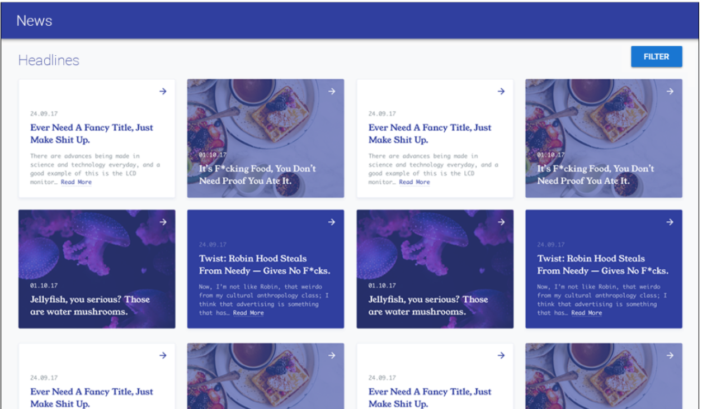

# Introduction

In this test, you will create a front-end application with Vue.js allowing a user to see the news from various websites using https://newsapi.org.

Your application has to use **Vue Router**, **Vuetify**, and **Vuex**. Your code needs to follow the **Airbnb javascript style guide**.  
Try to write a clean and understandable code that also focuses on optimization. A clean commit history and a README is recommended.

Keep track of the time you spend on each part of this project and send the link of publicly hosted repository via e-mail.

# Step 1

The first step focuses getting started with this new application.

- Create a Vue.js application
- Make use of Vuetify component framework to create the user interface
- You can find inspiration with the image below
- Create a first page the UI displaying the different news headlines (List view)
- Create another page using Vue Router displaying more information about a selected news headline (Detail view)
- Create a toolbar in a child **functional** component linked to each headline. 
  - One button will redirect the user to the selected headline page
  - A second button opens a popup/dialog with a text field to modify the headline's title. A validator is expected to prevent the new title to be too long.
- Display a history of the visited headlines
- Show off your CSS skills by making it look:
  - Nice (Interface Design)
  - Responsive (on Mobile, Tablet and Desktop)

# Step 2

This second step focuses on retrieving and managing data via a public API.

- Make an API call to this URL https://newsapi.org/v2/top-headlines?country=us&apiKey=API_KEY to get the latest headlines from different sources
- Display the headlines in the UI
- Make another API call to this URL https://newsapi.org/v2/sources?apiKey=API_KEY to get the list of sources
- Allow the user to select a source to display the filtered headlines
- Add a search bar to be able to fetch and display only headlines with the included text. You will call this URL https://newsapi.org/v2/top-headlines?q=SEARCH_TEXT&apiKey=API_KEY , Please note the api should be called as and when the user types or press the key.
- Add a spinner when the headlines are fetching
- Make a wrong API call to this URL https://newsapi.org/v2/sources?apiKey and display an error message
- Use Vuex for the state management

You can use `099148be22804e849a0c6fe022b7cf5e` as API_KEY (if this token is no longer valid, generate a new one from [here](https://newsapi.org/register))

# Bonus

- Implement unit tests (e.g. using **mocha-webpack** or alternatives of your choice)

# Example

